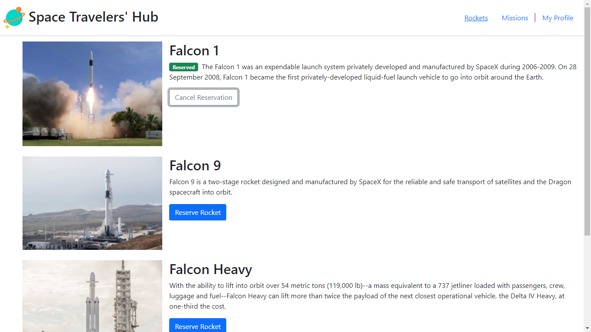
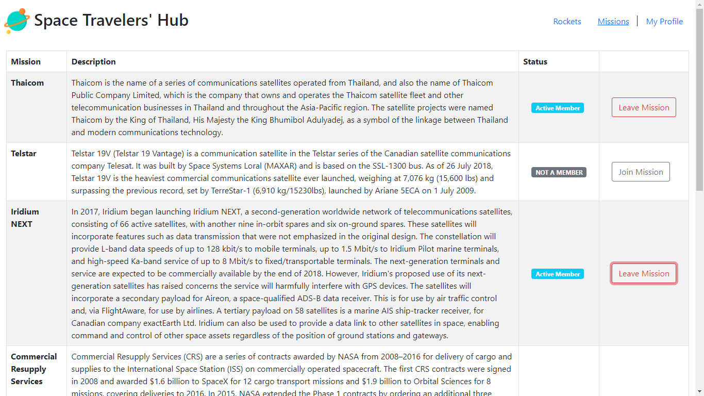

# Space Travellers' Hub
> In this task, we worked with the real live data from the SpaceX API. We built a web application for a company that provides commercial and scientific space travel services. The application allows users to book rockets and join selected space missions.

* @Toliboff worked on the Rockets section of this project
* @Ghiftee worked on the Missions section of this project

Each branch on this project was created from the dev branch and they represent a card on the Kanban board. After working on each card/branch(excluding the set-up branch which we worked on together), we reviewed each other's codes and did not begin work on the next card/branch until our pull request was approved.




## Live Link
- [Heroku](https://space-travellers.herokuapp.com/)
- [Netlify](https://space-travellers-app.netlify.app/)

## Built With

* HTML
* CSS
* Javascript
* React
* Redux
* SpaceX API

## Project Objectives

* Use React documentation.
* Use React components.
* Use React props.
* Use React Router.
* Connect React and Redux.
* Handle events in a React app.
* Write unit tests with React Testing Library.
* Use styles in a React app.
* Use React life cycle methods.
* Apply React best practices and language style guides in code.
* Use store, actions and reducers in React.
* Perform a code review for a team member.

## Getting Started

* Clone this repo with:

    ```bash
    git clone https://github.com/Ghiftee/space-travellers
    ```

* Navigate to the folder/directory

    ```bash
    cd space-travellers
    ```

* On the commandline, at the project's root, run ```npm install``` to install app dependencies
  
* Run ```npm start``` which will start and watch the project

* Go to localhost to interact with the app

## Authors
👤 **Tolibjon Tolibov**

- GitHub: [@toliboff](https://https://github.com/toliboff)
- LinkedIn: [Tolibjon](https://linkedin.com/in/tolibjon-tolibov)

👤 **Gift Uwhubetine**

- Github: [@Ghiftee](https://github.com/Ghiftee)
- LinkedIn: [gift-uwhubetine](https://www.linkedin.com/in/gift-uwhubetine-62675417a/)

Feel free to check the [issues page](../../issues/).

Give a ⭐️ if you like this project!
